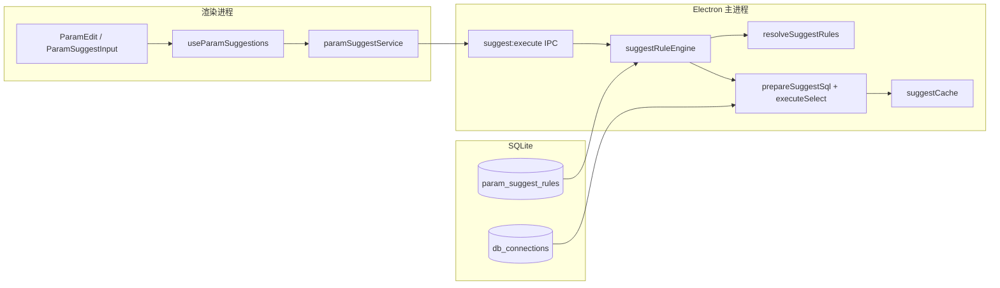
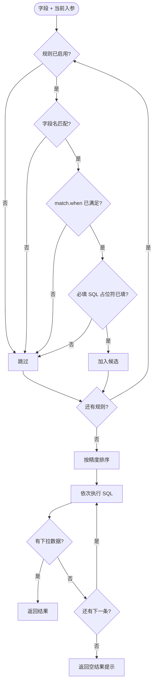
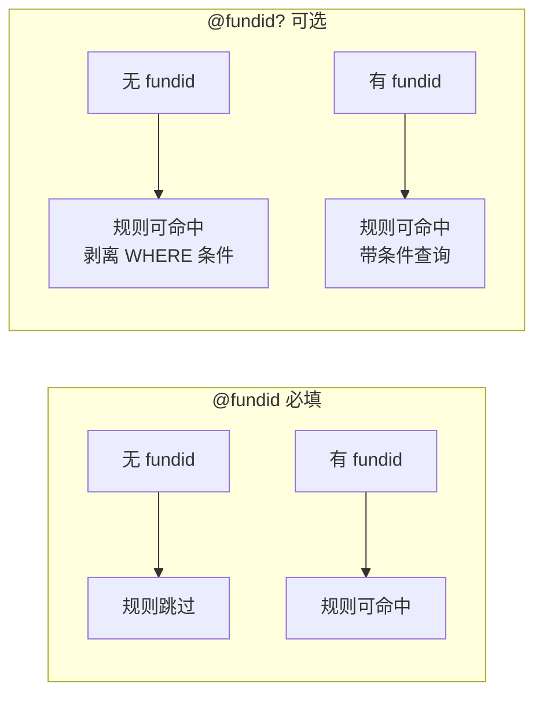
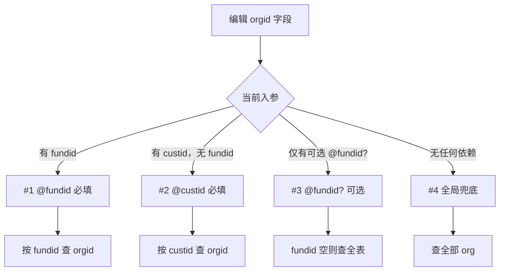
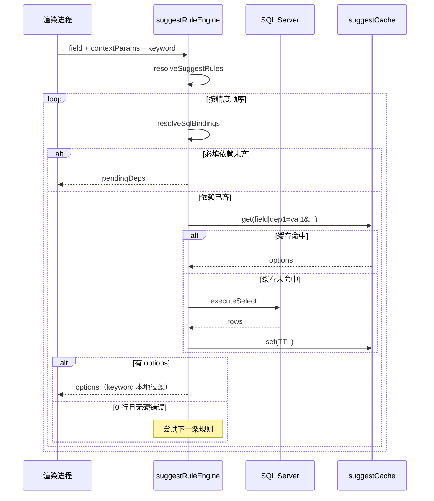

# 入参智能提示规则

Golden API 为请求参数表 Value 列提供可搜索下拉提示。规则配置保存在 SQLite `param_suggest_rules`，数据库连接保存在 `db_connections`，由 Electron 主进程执行 SQL 并缓存结果。

> **配置入口**：设置 → **提示规则**（字段侧栏、规则表、测试面板等操作流程见 [设置与偏好](./settings.md#提示规则api-调试)）。使用前须先在设置 → **数据库** 配置 SQL Server 连接。

## 参数表交互

在 API 调试 **UI 模式** 入参表 Value 列：

| 行为            | 说明                                                           |
| --------------- | -------------------------------------------------------------- |
| 聚焦查询        | 规则 `trigger: focus` 时，聚焦即按当前入参上下文查库           |
| 输入过滤        | 规则 `trigger: typing` 时，输入关键字本地过滤已返回选项        |
| 依赖未齐        | 命中规则但必填 SQL 占位符对应入参为空时，显示 pendingDeps 提示 |
| 无规则 / 未配库 | 退化为普通文本输入                                             |

下拉选项展示 `value`，若有 `remark` 则一并显示为说明文本。

## 整体架构



## 规则命中流程

同一字段可配置多条规则。请求下拉数据时，先按精度**排序所有当前场景下命中的规则**，再**按顺序依次执行 SQL**；若某条规则查询成功但返回 0 行，则继续尝试下一条，直至有数据或候选耗尽。



### 精度排序（高 → 低）

| 顺序 | 维度              | 说明                                                             |
| ---- | ----------------- | ---------------------------------------------------------------- |
| 1    | `match.when` 条数 | 每条 +10 分；仅判断入参**是否存在非空值**                        |
| 2    | SQL 占位符        | 每条必填 `@name` +2 分；仅含可选 `@name?` 时 +1 分（高于纯兜底） |
| 3    | `priority`        | 数值越大越优先                                                   |
| 4    | `id`              | 字母序兜底                                                       |

**可选占位符 `@name?`（英文问号）不参与跳过判断；入参缺失时规则仍可命中。**

### 空结果顺序 fallback

同一入参上下文下**可能同时命中多条规则**（例如：带 `@fundid` 的精确规则与全局兜底规则在填写 `fundid` 后均满足 `ruleMatchesContext`）。引擎按上表精度排序后**依次执行 SQL**：

| 结果                          | 行为                                 |
| ----------------------------- | ------------------------------------ |
| 有下拉选项                    | 立即返回，不再尝试后续规则           |
| 查询成功但 **0 行**           | 继续下一条规则                       |
| `pendingDeps`（必填依赖未齐） | 停止，提示补全入参                   |
| SQL 执行错误 / 列映射失败     | 停止，返回错误（不 silent fallback） |

典型用法：#1 按 `fundid` 查 `secuid`，无数据时自动 fallback 到 #2 全局 `secuid` 列表。

## SQL 占位符

| 写法       | 含义             | 入参为空时                                        |
| ---------- | ---------------- | ------------------------------------------------- |
| `@fundid`  | 必填             | **跳过该规则**（不命中）                          |
| `@fundid?` | 可选（英文 `?`） | **规则仍可命中**；执行时去掉对应 `where/and` 条件 |



同一 SQL 中若 `@fundid` 与 `@fundid?` 混用，按**必填**处理。

示例：

```sql
-- 必填：无 fundid 时跳过此规则
select value=orgid from fundinfo where fundid = @fundid

-- 可选：无 fundid 时仍可命中，执行等价于无 WHERE
select value=orgid from fundinfo where fundid = @fundid?

-- 混合：custid 必填，orgid 可选
select value=orgid from org where custid = @custid and orgid = @orgid?
```

## 典型配置：orgid 多规则



| 入参上下文         | 命中规则（按顺序尝试）                                      |
| ------------------ | ----------------------------------------------------------- |
| `fundid=1001`      | #1（精度更高）；若 #1 查无数据则继续 #4 兜底等仍命中的规则  |
| `custid=100145879` | #2（精度 1）                                                |
| 空                 | #4 兜底（精度 0）；若存在仅含 `@fundid?` 的规则则优先该规则 |

## `match.when` 与 SQL 依赖

两者可叠加，通常**不必重复配置**：

- **SQL 必填占位符**已能表达「需要某入参才命中」
- **`match.when`** 用于与 SQL 无关的额外条件，或占位符名与入参名不一致时

```
精度示例：
  when: market           → +10
  when: market + secuid  → +20
  @fundid 必填           → +1
```

## SQL 执行与缓存



### 缓存 Key

```
{字段小写}|{占位符名=值&...}    -- 键名按字母序
```

- 仅包含**已绑定**的 SQL 参数值
- **不含** `keyword`、规则 id、`match.when`
- 默认 TTL 300 秒；规则级可关缓存或改 TTL
- 重载 `db_connections` / `param_suggest_rules` 时清空缓存

## 规则文件格式

```json
{
  "rules": [
    {
      "id": "rule-orgid-by-fundid",
      "field": "orgid",
      "fields": ["orgid", "custorgid"],
      "type": "select",
      "enabled": true,
      "priority": 0,
      "match": { "when": { "market": "" } },
      "datasource": {
        "type": "sql",
        "db": "mssql",
        "sql": "select value=orgid, remark=orgname from run.dbo.org where fundid = @fundid",
        "cache": { "enabled": true, "ttlSeconds": 300 }
      }
    }
  ]
}
```

| 字段               | 说明                                               |
| ------------------ | -------------------------------------------------- |
| `field` / `fields` | 适用字段；`fields` 支持逗号分隔多字段              |
| `match.when`       | 要求已填写的入参名（存在非空值即可）               |
| `priority`         | 同精度下越大越优先                                 |
| `datasource.sql`   | 仅允许 `SELECT`；列别名固定 `value`，可选 `remark` |
| `datasource.cache` | 默认开启，TTL 默认 300 秒                          |

## 相关源码

| 模块                         | 路径                                                                      |
| ---------------------------- | ------------------------------------------------------------------------- |
| 规则命中 / 排序              | `src/shared/suggest/paramSuggestResolve.ts`（模块内 re-export）           |
| 空结果 fallback 判定         | `src/shared/suggest/suggestRuleFallback.ts`                               |
| SQL 占位符 / 绑定 / 缓存 key | `src/shared/suggest/paramSuggestSql.ts`                                   |
| 契约类型                     | `src/shared/suggest/types.ts`                                             |
| 主进程执行                   | `electron/services/suggest/suggestRuleEngine.ts`                          |
| 内存缓存                     | `electron/services/suggest/suggestCache.ts`                               |
| 设置页 CRUD                  | `src/modules/api-debug/components/settings/ParamSuggestRulesSettings.tsx` |
| 参数表下拉                   | `src/modules/api-debug/components/editor/ParamSuggestInput.tsx`           |
