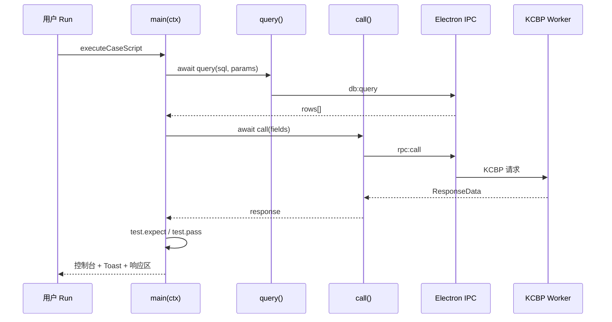
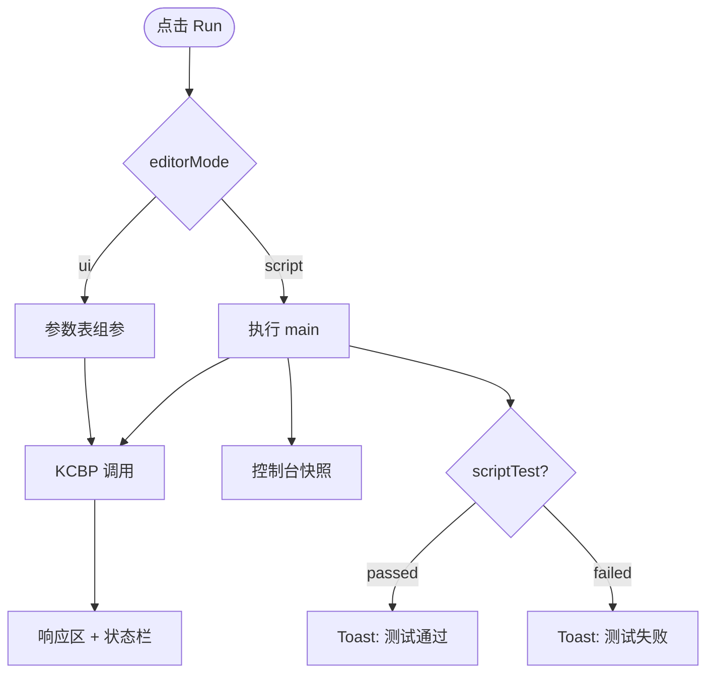

# 接口测试自动化（脚本模式）

Golden API 支持在**脚本模式**下为每个接口编写 JavaScript 自动化脚本：查库预检、组装入参、发起 KCBP 调用、断言结果，并在控制台与 Toast 中统一展示测试结论。

脚本保存在 `project.json` 的 `script` 字段，与 UI 模式的入参表相互独立；切换模式不会丢失数据。

---

## 快速开始

1. 在请求区 / 脚本区 **SectionHeader** 右侧点击 **「脚本模式」** 进入脚本编辑器。
2. 编写 `async function main(ctx) { ... }`。
3. 点击 **Run**（或 `Ctrl+Enter`）执行。
4. 在编辑器下方 **控制台** 查看 `test` / `console` 输出；底栏查看 KCBP 响应元信息。

地址栏右侧（Run 按钮旁）在脚本模式下提供：

| 图标   | 功能                                       |
| ------ | ------------------------------------------ |
| 格式化 | 使用 Prettier 格式化脚本（`Ctrl+Shift+F`） |
| 复制   | 复制地址与 UI 入参表 JSON                  |
| 清空   | 清空 UI 入参表（不影响 `script` 字段）     |

**UI 模式**下，Run 成功后会启用 **生成测试脚本** 图标（Snippets），一键把当前入参表转为带 `test` 断言的脚本并切换到脚本模式（见下文「录制脚本 MVP」）。

---

## 录制脚本 MVP（UI → 测试脚本）

面向「先在表格模式调通，再一键自动化」的场景。

### 使用步骤

1. 保持在 **UI 模式**，填写入参并 **Run 成功**（业务 `code` 成功，非 transport 失败）。
2. 点击地址栏 **生成测试脚本** 图标（Snippets，位于复制按钮左侧）。
3. 应用写入 `script` 并 **自动切换到脚本模式**；再次 Run 即可重复验证。

### 生成内容示例

入参 `market=1`、`stkcode=6004` 时生成：

```javascript
// 由 UI 模式「生成测试脚本」自动生成
async function main(ctx) {
  const response = await call({
    market: '1',
    stkcode: '6004',
  });

  test.expect(String(response.code) === '0', '业务成功');
  return test.pass('接口调用验证通过');
}
```

包含当前入参表中 **所有已启用字段**（`type !== 'disabled'`）。若无入参，则生成 `g_funcid: ctx.msgtype`。

### 启用条件

| 条件              | 说明                                                    |
| ----------------- | ------------------------------------------------------- |
| UI 模式           | 脚本模式下显示「格式化」而非「生成」                    |
| 最近一次 Run 成功 | 当前接口有响应且 `parseKcbpResponseStatus` 为 `success` |
| 非 loading        | Run 进行中按钮禁用                                      |

### 覆盖确认

若接口已有非空 `script` 且与即将生成的内容不同，会弹出确认：**覆盖生成 / 取消**。

### 局限（MVP）

- 不含 `query()` 查库预检、不含对 `response.data` 字段的业务断言。
- 仅生成 Smoke 测试（`code === '0'`）；复杂用例请在生成后继续编辑脚本。

实现：`generateTestScriptFromParams()`（`src/modules/api-debug/utils/script/apiScript.ts`）。

---

脚本**不是** `node test.js`，而是在 Electron **渲染进程**（与 React 界面同一 Chromium 环境）内，通过 `new Function` 动态编译执行。



### 与 UI 模式的区别

|                   | UI 模式              | 脚本模式                     |
| ----------------- | -------------------- | ---------------------------- |
| 入参来源          | 参数表勾选 + Value   | 脚本内 `await call({ ... })` |
| 是否执行 `script` | 否                   | 是                           |
| 数据库查询        | 否（仅入参下拉提示） | 是（`query()`）              |
| 测试断言          | 否                   | 是（`test`）                 |
| 控制台            | 否                   | 是                           |

---

## 脚本结构

每个接口脚本必须定义 **`async function main(ctx)`**，框架在 Run 时自动调用。

```javascript
async function main(ctx) {
  // 1. 可选：查库预检
  const rows = await query('SELECT custid FROM run.dbo.customer WHERE custid = @custid', {
    custid: '75500000008',
  });

  // 2. 发起 KCBP 调用（至少一次）
  const response = await call({
    g_serverid: '1',
    g_funcid: ctx.msgtype,
    orgid: '0101',
  });

  // 3. 断言并返回测试结果
  test.expect(response.code === '0', `业务成功，code=${response.code}`);
  return test.pass('接口验证通过');
}
```

**注意：**

- 脚本模式 Run 时，**必须**在 `main` 内至少调用一次 `await call(...)`，否则报错：`脚本未调用 call()，无法发送请求`。
- 可多次调用 `call()`，但响应区与状态栏仅展示**最后一次**调用的结果。
- 不支持 `require`、`import`、`fs` 等 Node API；仅可使用下文注入的全局对象。

---

## 注入的全局对象

Run 时向脚本注入 5 个全局变量（无需 import）：

| 全局变量  | 类型                                | 说明                             |
| --------- | ----------------------------------- | -------------------------------- |
| `ctx`     | `CaseScriptContext`                 | 当前接口上下文                   |
| `call`    | `(fields) => Promise<ResponseData>` | 发起 KCBP 请求                   |
| `query`   | `(sql, params?) => Promise<rows[]>` | 只读 SQL 查询                    |
| `test`    | `ScriptTestApi`                     | 结构化测试断言                   |
| `console` | `ScriptConsoleApi`                  | 调试输出（非浏览器原生 console） |

---

## `ctx` — 接口上下文

```typescript
interface CaseScriptContext {
  msgtype: string; // 地址栏 Msgtype，或接口名兜底
  address: string; // 完整 KCXP 地址串
  params: ParamItem[]; // UI 入参表（脚本模式 Run 时不直接用于发请求）
  fields: Record<string, string>; // UI 入参表启用的字段快照
  call: CaseCallFn; // 与全局 call 相同，ctx.call(...) 亦可
}
```

### 字段说明

| 字段          | 示例                       | 用途                     |
| ------------- | -------------------------- | ------------------------ |
| `ctx.msgtype` | `'150501'`                 | 拼 `g_funcid`、日志标识  |
| `ctx.address` | `'127.0.0.1:21000/150501'` | 读完整地址               |
| `ctx.params`  | `[{ name, value, type }]`  | 读 UI 表草稿，做动态组装 |
| `ctx.fields`  | `{ g_serverid: '1', ... }` | 已启用参数的键值对       |

### 从 UI 入参构建 call 字段

```javascript
async function main(ctx) {
  const fields = Object.fromEntries(
    ctx.params
      .filter((p) => p.type !== 'disabled' && p.name.trim())
      .map((p) => [p.name.trim(), p.value]),
  );
  fields.g_funcid = ctx.msgtype;
  return await call(fields);
}
```

---

## `call(fields)` — KCBP 请求

```typescript
type CallFieldValue = string | { file: string };
type CaseCallFn = (fields: Record<string, CallFieldValue>) => Promise<ResponseData>;
```

### 行为

1. 将 `fields` 与当前接口地址（Host / Queue / Timeout / Msgtype）组装为 KCBP payload。
2. 文本字段写入 `param.fields`；`{ file: '绝对路径' }` 写入 `param.binaryFields`，由主进程读取文件为 `Buffer` 后传给 adapter。
3. 经 `electronAPI.callKcbp` → 主进程 `rpc:call` → KCBP Worker 发送。
4. 返回 **`ResponseData`**（不会抛出业务失败；需自行检查 `code`）。

### 二进制文件入参

UI 入参表可将某行类型设为 **文件**，持久化绝对路径；Run 时主进程按 Buffer 方式传给 KCBP（见 `electron/adapter/README.md`）。

脚本模式使用对象语法：

```javascript
const response = await call({
  g_funcid: '856065',
  databody: { file: 'D:/data/1.zip' },
  datasize: '226', // 可省略；若为空且存在 databody，主进程自动填充字节数
});
```

注意：脚本内**不能**使用 `fs`；文件路径须为本地绝对路径，由 IPC 在主进程读取。

### 返回值 `ResponseData`

```typescript
interface ResponseData {
  code: string | number;
  message: string;
  data: Record<string, unknown>[]; // 业务数据行
  calledAt?: number;
  stats?: {
    timecost: number; // 耗时 ms
    rows: number; // 行数
  };
}
```

### 示例

```javascript
const response = await call({
  g_serverid: '1',
  g_funcid: '150501',
  g_operid: '2588',
  orgid: '0101',
  fundid: '8',
  stkcode: '6004',
  market: '1',
});

console.log('rows:', response.stats?.rows);
console.log('首行:', response.data[0]);
```

### 缺参自动回填

若 KCBP 返回缺少某入参，应用会自动将该参数追加到 UI 入参表，并将 `script` 同步改写为包含新字段的 `call(...)` 片段（与 UI 模式行为一致）。此时 Toast 为 info：`已自动添加入参 xxx，请填写后重新发送`。

---

## `query(sql, params?)` — 数据库只读查询

```typescript
type CaseScriptQueryFn = (
  sql: string,
  params?: Record<string, string | number>,
) => Promise<Record<string, unknown>[]>;
```

### 配置

- 连接信息：项目根目录 **`db.json`**（与入参智能提示共用）。
- 执行位置：Electron 主进程，IPC `db:query`。
- **仅允许 `SELECT`**；含 `INSERT` / `UPDATE` / `DELETE` 等关键字会被拒绝。

### SQL 占位符

与 [入参智能提示规则](./param-suggest-rules.md) 相同：

| 写法      | 含义 | 参数缺失时                        |
| --------- | ---- | --------------------------------- |
| `@custid` | 必填 | 抛出错误：`缺少 SQL 参数: custid` |
| `@orgid?` | 可选 | 剥离对应 WHERE 条件后执行         |

```javascript
const funds = await query(
  'SELECT custid, fundid FROM run.dbo.fundinfo WHERE fundid = @fundid AND orgid = @orgid',
  { fundid: '8', orgid: '0101' },
);
test.expect(funds.length > 0, 'fundid=8 在库中存在');
const expectedCustid = String(funds[0].custid);
```

### 错误处理

`query()` 失败时 **抛出 `Error`**（连接失败、SQL 非法、缺参等），不会返回空数组。请用 `try/catch` 或让错误冒泡到 `test` 外层。

---

## `test` — 测试对象

结构化断言 API，统一控制台样式与 Run 结论（Toast / 状态栏）。

### API

```typescript
interface ScriptTestApi {
  step(name: string): void;
  expect(condition: boolean, message: string): void;
  fail(message: string): never;
  pass(message?: string): ScriptTestResult;
  readonly result: ScriptTestResult;
}

interface ScriptTestResult {
  passed: boolean;
  message: string;
  steps: { name: string; status: 'pass' | 'fail'; message: string }[];
}
```

### 方法说明

| 方法                        | 成功                              | 失败                                      |
| --------------------------- | --------------------------------- | ----------------------------------------- |
| `test.step('名称')`         | 控制台输出灰色 `step` 行          | —                                         |
| `test.expect(cond, '说明')` | 控制台绿色 `pass` 行              | 中断脚本，红色 `fail`，Toast **测试失败** |
| `test.fail('原因')`         | —                                 | 同 `expect(false, ...)`                   |
| `test.pass('总结')`         | 绿色 `[完成]`，Toast **测试通过** | —                                         |
| `test.result`               | 只读，查看当前累计结果            | —                                         |

### 推荐写法

```javascript
async function main(ctx) {
  const TARGET = '75500000008';

  test.step('预检客户');
  const customers = await query('SELECT custid FROM run.dbo.customer WHERE custid = @custid', {
    custid: TARGET,
  });
  test.expect(customers.length > 0, `数据库中存在客户 ${TARGET}`);

  test.step('执行接口');
  const response = await call({ g_funcid: ctx.msgtype, g_serverid: '1' });
  test.expect(String(response.code) === '0', `业务 code=${response.code}`);

  test.step('校验返回数据');
  const rows = response.data ?? [];
  const matched = rows.some((row) => String(row.custid ?? '') === TARGET);
  test.expect(
    matched,
    matched
      ? `返回 ${rows.length} 行，已找到 custid=${TARGET}`
      : `返回 ${rows.length} 行，未找到 custid=${TARGET}`,
  );

  return test.pass(`客户 ${TARGET} 验证通过`);
}
```

### 断言消息注意

`test.expect` 的第二个参数是**固定描述**，成功失败都会原样显示。失败场景请写清楚「未满足」的含义，避免写成「包含 xxx」造成误解。

### 返回值约定

- **推荐**：`return test.pass('...')` — 明确标记测试通过。
- `return false` / `return true` — 仅作为普通返回值显示在控制台 `return` 行，**不会**触发测试通过/失败 Toast。
- 普通 `throw new Error(...)` — 视为脚本运行时错误，非结构化测试失败。

---

## `console` — 调试输出

自定义控制台，输出显示在脚本编辑器下方。**不是**浏览器 DevTools 的 `console`。

```typescript
interface ScriptConsoleApi {
  log(...args: unknown[]): void;
  info(...args: unknown[]): void;
  warn(...args: unknown[]): void;
  error(...args: unknown[]): void;
}
```

| 级别    | 控制台样式 | 用途                               |
| ------- | ---------- | ---------------------------------- |
| `log`   | 默认       | 一般调试                           |
| `info`  | 次要文字色 | 提示信息                           |
| `warn`  | 橙色       | 警告                               |
| `error` | 红色       | 错误（不中断脚本，除非自行 throw） |

对象参数会自动 `JSON.stringify`（带缩进）。控制台支持 **清空** 按钮；记录按接口 `caseId` 内存缓存，删除接口时自动清理。

`test` 产生的 `step` / `pass` / `fail` 行与 `console.*` 行混排展示。

---

## 控制台输出级别一览

| level                             | 来源                                | 含义           |
| --------------------------------- | ----------------------------------- | -------------- |
| `step`                            | `test.step`                         | 测试步骤开始   |
| `pass`                            | `test.expect` 成功 / `test.pass`    | 断言或测试通过 |
| `fail`                            | `test.expect` 失败 / `test.fail`    | 断言或测试失败 |
| `log` / `info` / `warn` / `error` | `console.*`                         | 用户调试       |
| `return`                          | `main` 非 `ScriptTestResult` 返回值 | 脚本返回值     |

---

## Run 结果与 UI 反馈



| 场景                | Toast                   | 状态栏 Success |
| ------------------- | ----------------------- | -------------- |
| `test.pass()`       | 测试通过：…（含行数）   | 是             |
| `test.expect` 失败  | 测试失败：…             | 否             |
| 脚本语法错误        | 错误信息                | 否             |
| 仅 `call` 无 `test` | xxx 调用完成，返回 N 行 | 视业务 code    |

测试失败时，若 `call()` 已成功，**响应数据仍会保留**在响应区，便于对照断言。

---

## 持久化与模式切换

| 数据         | 存储位置             | 说明                       |
| ------------ | -------------------- | -------------------------- |
| `script`     | `project.json`       | 当前接口脚本正文           |
| `params`     | `project.json`       | UI 入参表                  |
| `editorMode` | `api-debug.env.json` | API 调试 UI / 脚本模式偏好 |
| 控制台记录   | 内存                 | 不持久化                   |
| KCBP 响应    | 内存                 | 不持久化                   |

从 UI 模式切到脚本模式时，若 `script` 为空，会自动根据当前入参表生成带 `await call({...})` 的模板。

---

## 完整示例：查库 + 调用 + 断言

```javascript
const TARGET_CUSTID = '75500000008';

async function main(ctx) {
  test.step('预检客户');
  const customers = await query('SELECT custid FROM run.dbo.customer WHERE custid = @custid', {
    custid: TARGET_CUSTID,
  });
  test.expect(customers.length > 0, `数据库中存在客户 ${TARGET_CUSTID}`);

  test.step('执行 150501');
  const response = await call({
    g_serverid: '1',
    g_funcid: '150501',
    g_operid: '2588',
    g_operpwd: '',
    g_operway: '',
    g_stationaddr: '',
    g_checksno: '',
    orgid: '0101',
    fundid: '8',
    secuid: '',
    stkcode: '6004',
    orderprice: '',
    market: '1',
    bsflag: '',
  });

  console.log('首行列名:', response.data[0] ? Object.keys(response.data[0]).join(', ') : '(无)');

  test.step('校验返回 custid');
  const rows = Array.isArray(response.data) ? response.data : [];
  const matched = rows.some((row) => String(row?.custid ?? '') === TARGET_CUSTID);
  test.expect(
    matched,
    matched
      ? `返回 ${rows.length} 行，已找到 custid=${TARGET_CUSTID}`
      : `返回 ${rows.length} 行，未找到 custid=${TARGET_CUSTID}`,
  );

  return test.pass(`客户 ${TARGET_CUSTID} 委托查询验证通过`);
}
```

---

## 编辑器功能

| 功能         | 操作                                       |
| ------------ | ------------------------------------------ |
| 语法高亮     | CodeMirror + `@codemirror/lang-javascript` |
| 格式化       | 地址栏格式化图标，或 `Ctrl+Shift+F`        |
| 防抖保存     | 编辑后延迟写入 `project.json`              |
| Run 前 flush | 自动提交未保存的脚本草稿                   |

格式化规则与项目 `.prettierrc` 一致（单引号、4 空格、`printWidth: 100` 等）。

---

## 限制与安全

1. **非 Node 环境**：无 `require` / `import` / 文件读写 / 网络 fetch（KCBP 只能走 `call()`）。
2. **非严格沙箱**：`new Function` 在渲染进程执行，理论上可访问 `window`；仅用于可信的接口自动化，不要运行来源不明的脚本。
3. **`query` 只读**：禁止写操作 SQL；结果行数受 `db.json` 的 `maxRows` 限制（默认 500）。
4. **CSP 开发警告**：开发模式下 Electron 可能提示 `unsafe-eval`（脚本编译需要），打包后不影响使用。

---

## 相关源码

| 模块         | 路径                                                          |
| ------------ | ------------------------------------------------------------- |
| 脚本编译执行 | `src/modules/api-debug/utils/script/apiScript.ts`             |
| 测试对象     | `src/modules/api-debug/utils/script/scriptTest.ts`            |
| 控制台捕获   | `src/modules/api-debug/utils/script/scriptConsole.ts`         |
| Run 编排     | `src/modules/api-debug/services/kcbpCallService.ts`           |
| 脚本 UI      | `src/modules/api-debug/components/editor/CaseScriptPanel.tsx` |
| SQL 查询 IPC | `electron/suggestRuleEngine.ts` → `executeScriptQuery`        |
| 数据库配置   | `db.json`                                                     |

---

## 另见

- [开发质量与验收](./quality.md) — 本地/CI 门禁、冒烟清单、测试策略
- [入参智能提示规则](./param-suggest-rules.md) — `query()` 占位符与 `db.json` 说明
- 项目约定 — 根目录 `AGENTS.md`
